# Guía de Versionado

Esta guía explica cómo implementar el versionado en el proyecto de analytics, usando Git para el código y Dataform para las transformaciones SQL.

## Estrategia de Versionado

### 1. Git - Versionado de Código

El repositorio usa **Git** para versionar:
- Scripts SQL (`sql/`)
- DAGs de Airflow (`airflow/`)
- Configuración (`setup/`, `dataform/`)
- Documentación (`docs/`)

### 2. Dataform - Versionado de Transformaciones SQL (Opcional)

**Dataform** gestiona dependencias y versionado de transformaciones SQL en BigQuery.

## Configuración de Git

### Inicializar Repositorio

```bash
# Si el repo no está inicializado
git init

# Agregar archivos
git add .

# Primer commit
git commit -m "Initial commit: GA4 analytics pipeline"

# Conectar con remoto (GitHub, GitLab, etc.)
git remote add origin https://github.com/tu-org/repo-analytics.git
git branch -M main
git push -u origin main
```

### Estructura de Branches

```
main (producción)
  ├── develop (desarrollo)
  ├── feature/nueva-transformacion
  ├── feature/nueva-dimension
  └── hotfix/fix-bug-critico
```

**Branching Strategy:**

1. **`main`**: Código en producción
   - Solo merge desde `develop` o `hotfix`
   - Protegido (requiere PR + approval)

2. **`develop`**: Desarrollo activo
   - Branch de integración
   - Todos los `feature/*` mergean aquí

3. **`feature/*`**: Nuevas funcionalidades
   - Ejemplo: `feature/agregar-dim-geo`
   - Crear desde `develop`
   - Merge a `develop` cuando esté listo

4. **`hotfix/*`**: Correcciones urgentes
   - Crear desde `main`
   - Merge a `main` y `develop`

### Ejemplo de Flujo de Trabajo

```bash
# 1. Crear feature branch
git checkout develop
git pull origin develop
git checkout -b feature/agregar-campo-utm

# 2. Hacer cambios
# Editar sql/stage/stg_events_flat.sql

# 3. Commit
git add sql/stage/stg_events_flat.sql
git commit -m "feat: agregar campos UTM a stg_events_flat"

# 4. Push y crear PR
git push origin feature/agregar-campo-utm

# 5. Merge a develop (después de review)
# Desde GitHub/GitLab UI: crear Pull Request
```

### Convención de Commits

Usar [Conventional Commits](https://www.conventionalcommits.org/):

```
feat: agregar nueva dimensión dim_device
fix: corregir JOIN en fact_sessions
docs: actualizar guía de despliegue
refactor: optimizar query de stg_events_flat
test: agregar assertions para stg_sessions
chore: actualizar dependencias de Airflow
```

## Dataform - Versionado de SQL

### ¿Qué es Dataform?

**Dataform** gestiona transformaciones SQL en BigQuery con:
- **Dependencias**: Define orden de ejecución automáticamente
- **Versionado**: Integrado con Git
- **Testing**: Assertions y validaciones
- **Documentación**: Comentarios y metadata

### Configuración de Dataform

El proyecto ya tiene la estructura de Dataform en `dataform/`:

```
dataform/
├── dataform.json          # Configuración del proyecto
├── includes/
│   └── macros.sql         # Macros reutilizables
└── definitions/
    ├── stage/
    │   ├── stg_events_flat.sqlx
    │   ├── stg_sessions.sqlx
    │   └── stg_users.sqlx
    └── olap/
        ├── dimensions/
        └── facts/
```

### Instalar Dataform CLI

```bash
# Instalar Node.js (prerrequisito)
# https://nodejs.org/

# Instalar Dataform CLI
npm install -g @dataform/cli

# Verificar instalación
dataform --version
```

### Configurar Dataform con GCP

```bash
# Autenticarse en GCP
gcloud auth application-default login

# Configurar proyecto
cd dataform
# Editar dataform.json y reemplazar PROJECT_ID
```

### Uso de Dataform

```bash
# Compilar proyecto (valida sintaxis y dependencias)
dataform compile

# Ejecutar transformaciones (desarrollo)
dataform run

# Ejecutar transformaciones específicas
dataform run --tags stage

# Test (ejecutar assertions)
dataform test

# Ver DAG de dependencias
dataform run-graph
```

### Integración con Git

Dataform se integra automáticamente con Git:

```bash
# 1. Crear feature branch
git checkout -b feature/dataform-stg-events

# 2. Editar transformación
# Editar dataform/definitions/stage/stg_events_flat.sqlx

# 3. Compilar y validar
dataform compile

# 4. Commit
git add dataform/
git commit -m "feat: actualizar stg_events_flat con Dataform"

# 5. Push
git push origin feature/dataform-stg-events
```

### CI/CD con Dataform (Opcional)

Ejemplo de `.github/workflows/dataform.yml`:

```yaml
name: Dataform CI/CD

on:
  push:
    branches: [main, develop]
    paths:
      - 'dataform/**'

jobs:
  compile:
    runs-on: ubuntu-latest
    steps:
      - uses: actions/checkout@v2
      - uses: actions/setup-node@v2
        with:
          node-version: '18'
      - run: npm install -g @dataform/cli
      - run: cd dataform && dataform compile
  
  test:
    runs-on: ubuntu-latest
    needs: compile
    steps:
      - uses: actions/checkout@v2
      - uses: actions/setup-node@v2
        with:
          node-version: '18'
      - run: npm install -g @dataform/cli
      - uses: google-github-actions/auth@v0
        with:
          credentials_json: ${{ secrets.GCP_SA_KEY }}
      - run: cd dataform && dataform test
  
  deploy:
    runs-on: ubuntu-latest
    needs: test
    if: github.ref == 'refs/heads/main'
    steps:
      - uses: actions/checkout@v2
      - uses: actions/setup-node@v2
        with:
          node-version: '18'
      - run: npm install -g @dataform/cli
      - uses: google-github-actions/auth@v0
        with:
          credentials_json: ${{ secrets.GCP_SA_KEY }}
      - run: cd dataform && dataform run
```

## Alternativa: Solo Git (Sin Dataform)

Si no usas Dataform, puedes versionar los scripts SQL directamente con Git:

### Estructura de Versionado

```
sql/
├── stage/
│   ├── stg_events_flat.sql    # Versión actual
│   └── stg_events_flat_v2.sql # Nueva versión (para migración)
```

### Migración de Versiones

```bash
# 1. Crear backup de versión actual
cp sql/stage/stg_events_flat.sql sql/stage/stg_events_flat_v1.sql

# 2. Crear nueva versión
git checkout -b feature/stg-events-v2
# Editar sql/stage/stg_events_flat.sql

# 3. Crear script de migración
# sql/migrations/2024-01-15_update_stg_events_flat.sql
CREATE OR REPLACE TABLE ... AS
SELECT ... FROM ...;

# 4. Commit
git add sql/
git commit -m "feat: migrar stg_events_flat a v2"

# 5. Documentar cambios
# docs/migrations/2024-01-15_stg_events_flat_v2.md
```

## Versionado de Airflow DAGs

Los DAGs de Airflow se versionan con Git y se despliegan automáticamente:

### Despliegue Automático

```bash
# 1. Subir DAGs al bucket de Composer
COMPOSER_BUCKET="gs://us-central1-ga4-composer-xxxxx-bucket"

# Desde CI/CD o manualmente
gsutil -m cp -r airflow/dags/* $COMPOSER_BUCKET/dags/
```

### Versionado de DAGs

```python
# airflow/dags/ga4_pipeline.py
dag = DAG(
    "ga4_pipeline",
    version="1.2.0",  # Versionar DAGs
    description="Pipeline ETL diario GA4 → BigQuery → OLAP",
    ...
)
```

## Tags y Releases

### Crear Release en Git

```bash
# 1. Preparar release
git checkout main
git pull origin main

# 2. Crear tag
git tag -a v1.0.0 -m "Release v1.0.0: Pipeline inicial completo"
git push origin v1.0.0

# 3. Crear release en GitHub/GitLab
# Desde la UI: crear release desde el tag
```

### Versionado Semántico

- **v1.0.0**: Release inicial
- **v1.1.0**: Nuevas features (backward compatible)
- **v1.1.1**: Bug fixes
- **v2.0.0**: Breaking changes

## Documentación de Cambios

### CHANGELOG.md

Mantener un archivo `CHANGELOG.md`:

```markdown
# Changelog

## [1.1.0] - 2024-01-15

### Added
- Nueva dimensión dim_device
- Validaciones de Data Quality

### Changed
- Optimizado clustering en fact_sessions

### Fixed
- Corregido JOIN en stg_sessions

## [1.0.0] - 2024-01-01

### Added
- Pipeline inicial GA4 → BigQuery → OLAP
```

## Mejores Prácticas

### 1. Siempre Documentar Cambios

```sql
-- sql/stage/stg_events_flat.sql
-- Versión: 1.2.0
-- Última actualización: 2024-01-15
-- Cambios v1.2.0:
--   - Agregado campo page_domain
--   - Optimizado clustering
```

### 2. Testing Antes de Merge

```bash
# Compilar Dataform antes de commit
dataform compile

# Ejecutar assertions
dataform test

# Validar sintaxis SQL
bq query --dry_run < sql/stage/stg_events_flat.sql
```

### 3. Code Review

- Todos los cambios a `main` o `develop` requieren PR
- Mínimo 1 approval para merge
- Revisar:
  - Lógica SQL
  - Performance (particionado/clustering)
  - Data Quality checks

### 4. Rollback Plan

Siempre tener plan de rollback:

```bash
# 1. Identificar commit anterior
git log --oneline

# 2. Revertir cambios
git revert <commit-hash>

# 3. O crear hotfix
git checkout -b hotfix/rollback-stg-events
git checkout main -- sql/stage/stg_events_flat.sql
git commit -m "hotfix: rollback stg_events_flat a v1.1.0"
```

## Resumen de Flujo Completo

```mermaid
graph LR
    A[Desarrollador] -->|git checkout| B[feature branch]
    B -->|Editar código| C[SQL/DAGs]
    C -->|dataform compile| D[Validar]
    D -->|git commit| E[Commit]
    E -->|git push| F[PR]
    F -->|Review| G[Approve]
    G -->|Merge| H[develop]
    H -->|Test| I[QA]
    I -->|Deploy| J[Producción]
```



## Referencias

- [Git Documentation](https://git-scm.com/doc)
- [Dataform Documentation](https://cloud.google.com/dataform/docs)
- [Conventional Commits](https://www.conventionalcommits.org/)
- [Semantic Versioning](https://semver.org/)
